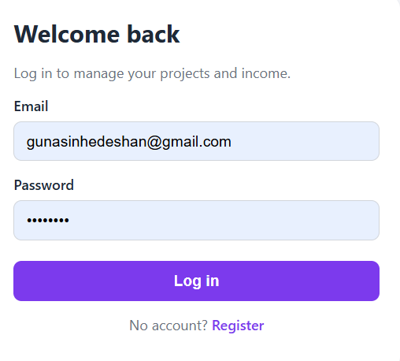
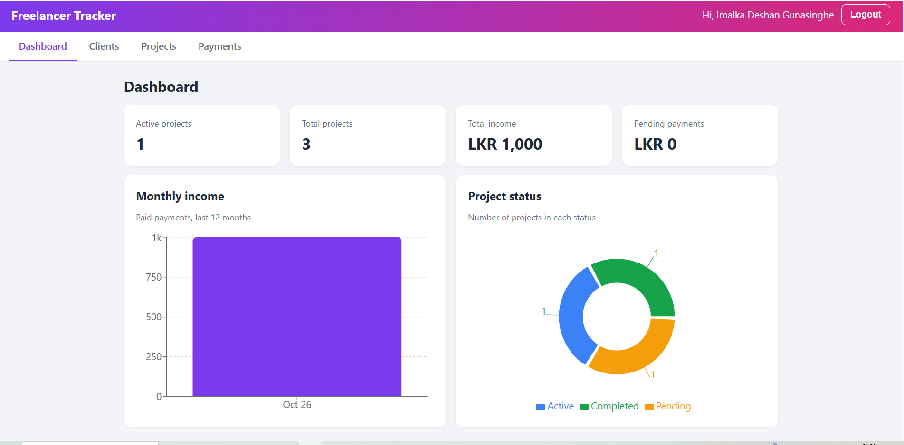
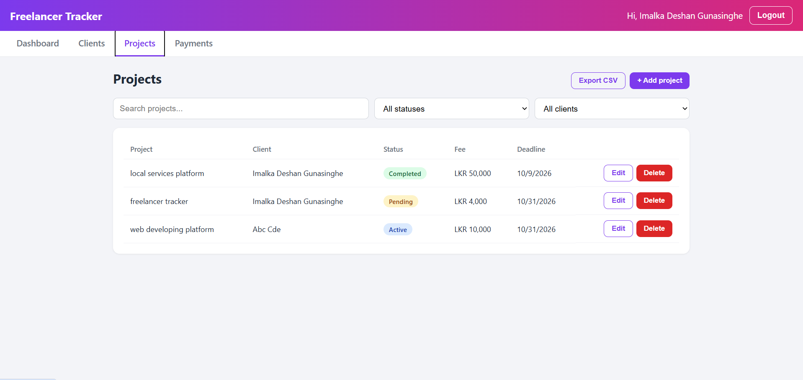
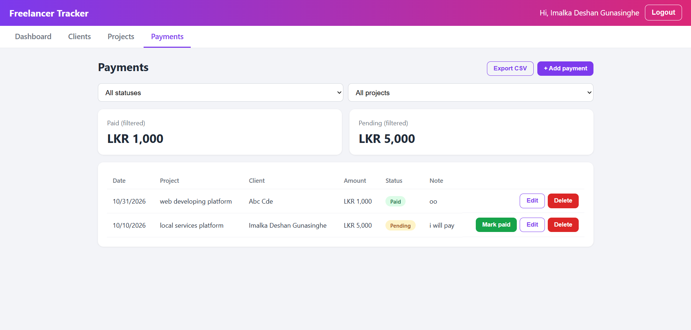
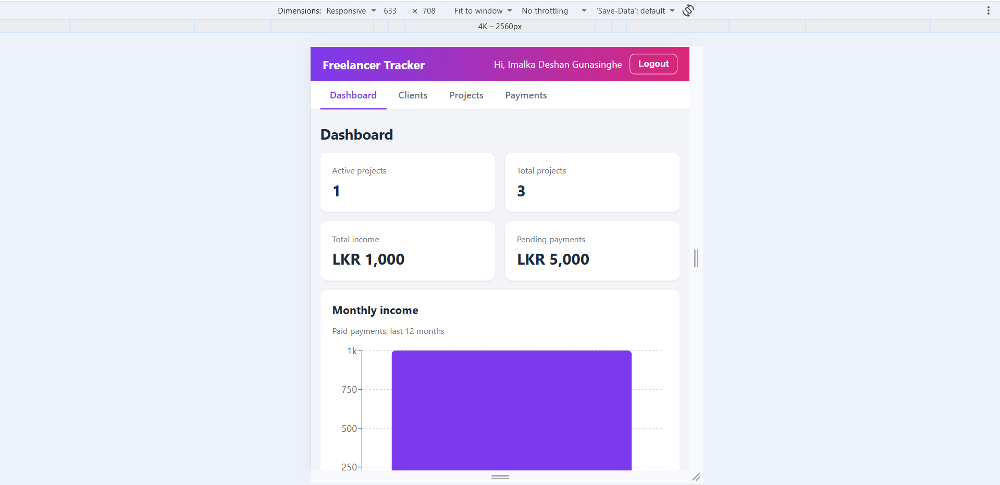

# Freelancer Project & Income Tracker

A full-stack MERN web application that helps freelancers manage their clients,
projects, and income in one place. Built as an individual assignment for
Software Engineering Team - 405.

## Features

- User registration and login with JWT authentication and protected routes
- Dashboard with active projects, total income, pending payments
- Charts: monthly income (bar chart) and project status (pie chart)
- Add, edit, and delete clients, projects, and payments
- Search and filter projects by status or client; filter payments by status or project
- Pagination for clients, projects, and payments
- Export projects and payments to CSV
- Form validation (client-side and server-side) and clear error messages
- Responsive layout for desktop and mobile

## Tech Stack

| Layer | Technology |
|---|---|
| Frontend | React (Vite), React Router, Axios, Recharts |
| Backend | Node.js, Express.js |
| Database | MongoDB with Mongoose |
| Security | JWT, bcrypt.js, express-validator |
| Version control | Git and GitHub |

## Screenshots

| Login | Dashboard |
|---|---|
|  |  |

| Projects | Payments |
|---|---|
|  |  |

| Mobile view |
|---|
|  |

## Project Structure

```
freelancer-tracker/
├── client/   React frontend
└── server/   Express API (models, controllers, routes, middleware)
```

## Setup Instructions

### Prerequisites
- Node.js 20 or later
- A MongoDB Atlas account (or a local MongoDB installation)

### 1. Clone the repository
```bash
git clone https://github.com/gunasinhedeshan-ui/freelancer-tracker.git

cd freelancer-tracker
```

### 2. Backend
```bash
cd server
npm install
```
Create a `.env` file in the `server` folder (see `.env.example`):
```
PORT=5000
MONGO_URI=<your MongoDB connection string>
JWT_SECRET=<a long random string>
```
Start the server:
```bash
npm run dev
```
The API runs at `http://localhost:5000`.

### 3. Frontend
In a second terminal:
```bash
cd client
npm install
npm run dev
```
Open the URL shown in the terminal (usually `http://localhost:5173`).

## API Overview

All routes except `/api/auth/*` require the header `Authorization: Bearer <token>`.

| Method | Endpoint | Description |
|---|---|---|
| POST | `/api/auth/register` | Create an account |
| POST | `/api/auth/login` | Log in and receive a JWT |
| GET, POST | `/api/clients` | List (with `?search=`) or create clients |
| PUT, DELETE | `/api/clients/:id` | Update or delete a client |
| GET, POST | `/api/projects` | List (with `?status=&client=&search=`) or create projects |
| PUT, DELETE | `/api/projects/:id` | Update or delete a project |
| GET, POST | `/api/payments` | List (with `?status=&project=`) or create payments |
| PUT, DELETE | `/api/payments/:id` | Update or delete a payment |
| GET | `/api/dashboard` | Totals and chart data |

## Security Notes

- Passwords are hashed with bcrypt before being stored.
- Every query is scoped to the logged-in user, so users can only see their own data.
- Secrets are stored in `.env`, which is excluded from Git.

## Author

<imalka deshan gunasinghe>